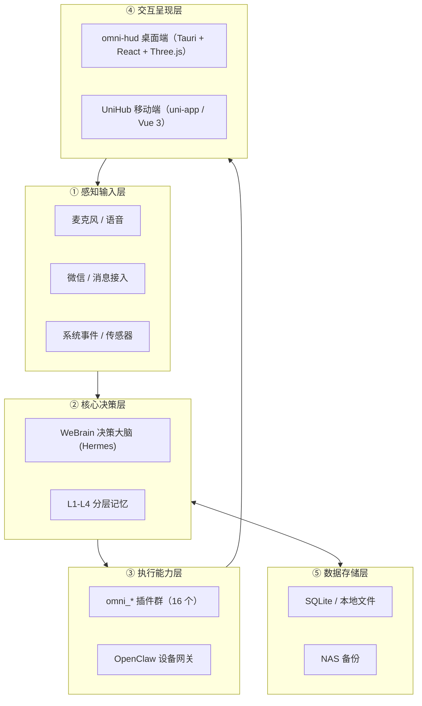

# AI-Omni

> 本地大脑 + 插件化能力的 AI 全能助手 —— 五层架构，隐私优先，核心数据全部本地运行。

**当前状态：M0–M46 全部完成** · 3080 项 pytest 自动化测试 · 桌面端 / 移动端 / 演示视频三线落地

AI-Omni 是一个**完全运行在本地基础设施上**的个人 AI 全能助手：决策大脑复用 WeBrain (Hermes)，所有能力以 `omni_*` 插件形式按需接入。语音、音乐、家居、办公、微信、天气等能力已全部落地，用户数据不出内网。

- **隐私优先**：核心数据（记忆、对话、文件）全部本地运行与存储，无外发。
- **资产复用**：不重写已有本地资产（WeBrain / flipped / LUVU 等），只做编排与插件化封装；WeBrain 核心代码只读不改。
- **TDD 驱动**：测试先行，单元测试全部基于 fake 后端，无需音频硬件与 GPU；覆盖率门槛 ≥ 80%。

---

## 五层架构



---

## 三大交付线

| 交付线 | 目录 | 技术栈 | 里程碑 | 说明 |
|--------|------|--------|--------|------|
| 桌面端 | `omni-hud/` | Tauri/Rust + React + Three.js | M0–M26 | 沉浸式粒子空间（WebGL 分档）、WellZone 交互井、实时字幕、音乐 Dock、Agent 面板、壁纸模式 |
| 移动端 | `UniHub/` | uni-app / Vue 3 | M1–M36 | Film Atelier 暗房风格：底部导航、语音交互、音乐播放、家居控制、天气、文档/邮件/日程 |
| 演示视频 | `demo-video/` | Remotion + Canvas 2D 粒子引擎 | M40–M46 | 59s 产品演示（程序化粒子引擎 + 雪莉旁白 + 暗房 BGM），产出 `out/ai-omni-demo-v7.mp4` |

---

## 插件矩阵（omni-brain/plugins/）

所有能力均为 `OmniPlugin` 插件（M15 起 `omni_sdk` 正式化，旧 `register(ctx)` 经 `compat.py` 适配），共 16 个：

| 插件 | 能力 |
|------|------|
| `omni_sdk` | 插件基座：生命周期、事件总线、权限、身份配置（雪莉 Sherry 单一数据源） |
| `omni_voice` | 语音管道：VAD 唤醒 → 网关 ASR → Agent → IndexTTS2 播报，全本地 |
| `omni_home` | 智能家居：Home Assistant WebSocket 同步、NLU、场景控制 |
| `omni_music` | 音乐：网易云/QQ/本地源、歌库、解密、看管扫描 |
| `omni_lyrics` | 歌词总线：LRC 解析、逐行同步（订阅 `music.started` 事件联动） |
| `omni_office` | 办公：文档 / 邮件 / 日程 + HTTP 服务 |
| `omni_wechat` | 微信：腾讯 iLink Bot API 收发全链路（唯一低风险方案） |
| `omni_weather` | 天气：Open-Meteo、情绪歌单联动 |
| `omni_openclaw` | 集群网关：设备状态、AICG、多模态（读根目录 `设备说明.md`） |
| `omni_volume` / `omni_brightness` / `omni_power` / `omni_process` / `omni_performance` / `omni_screenshot` / `omni_fullscreen_detect` | macOS 系统辅助插件矩阵 |

---

## 目录结构

```
AI-Omni/
├── omni-brain/plugins/    # Python 后端：16 个 omni_* 插件（唯一新增代码形态）
├── omni-hud/              # 桌面端：Tauri/Rust 壳 + React 前端 + Three.js 粒子空间
│   ├── src/               # React 前端
│   ├── src-tauri/         # Rust 壳（voice/music/lyrics/office/weather IPC）
│   └── e2e/               # Playwright E2E（页面对象模型 + fake Tauri IPC）
├── UniHub/                # 移动端：uni-app / Vue 3 跨端应用
├── demo-video/            # Remotion 演示视频（particles/ 程序化粒子引擎）
├── docs/specs/            # 现行规范引用的设计文档（m5 / m12–m26）
├── tests/                 # pytest 主测试目录（全 fake 后端，无硬件依赖）
├── STATE.json             # 项目状态中枢（里程碑 / 约束 / 上游资产）
├── TEST_LOG.md            # 测试日志（按里程碑时间序，含代码片段与结果）
├── 设备说明.md            # 集群设备清单（omni_openclaw 插件读取）
├── AGENTS.md              # 集群操作记忆与决策记录（每次会话必读）
├── CLAUDE.md              # 代码规范（Python / 插件 / UI / 测试）
└── pyproject.toml         # pytest 与覆盖率配置（fail_under = 80）
```

---

## 快速开始

### 环境要求

- Python ≥ 3.11（开发机 3.14）；Node ≥ 20；pnpm
- 单元测试**不需要**音频硬件 / GPU / 网络（全部 fake 后端）

### 运行测试

```bash
# 全量回归（3080+ 用例）
python3 -m pytest

# 桌面端 E2E（Playwright，fake Tauri IPC）
cd omni-hud/e2e && pnpm test
```

### 真机语音

```bash
pip install sounddevice   # 仅真机需要
PYTHONPATH=omni-brain/plugins python3 -m omni_voice run
```

> ASR / TTS / Embedding 经 Workstation 独立端点接入，本地不加载推理模型；VAD 为纯 Python 能量检测，零依赖。

---

## 基础设施（2026-08-11 SSH 实测）

| 节点 | 硬件 | 服务 |
|------|------|------|
| workstation `192.168.71.127` | 4× RTX PRO 6000 | IndexTTS2 `:9200` ✅ · faster-whisper ASR `:9210` ✅ · Qwen3-Embedding-4B `:9302` ✅ · ComfyUI `:8189` · FlashTalk / OpenTalking 数字人 |
| studio01–04 | 4× Mac Studio M3 Ultra 512GB | EXO RDMA 集群：GLM-5.2-fp8 |
| pc01 / pc02 | 2× RTX 5090 | ComfyUI worker `:8188` / `:8193`（NAS 模型库） |
| openclaw01–04 | 4× Mac mini M2 | OpenClaw 网关 `:18789` |
| NAS | `192.168.71.7` | 模型 / 数据备份 44T |

> **LLM 端点**：`omni_voice` / `omni_openclaw` 默认 LLM 已切换至 Mac Studio EXO 集群（studio01 `:52415/v1`，`mlx-community/GLM-5.2-fp8`，2026-08-14 实测在线）；Workstation Nemotron vLLM `:8000` 已于 2026-08-05 退役。集群完整状态见 [AGENTS.md](AGENTS.md)。

---

## 文档导航

- [STATE.json](STATE.json) / [TEST_LOG.md](TEST_LOG.md) — 项目状态中枢与测试日志（M0–M46 全程）
- [AGENTS.md](AGENTS.md) — 集群设备清单、GPU 分配、凭据、易错点（每次会话必读）
- [CLAUDE.md](CLAUDE.md) — 代码规范：插件契约、OmniPlugin 基类、惰性导入、UI 约束、测试要求
- [docs/specs/transformation-plan-m12-m26.md](docs/specs/transformation-plan-m12-m26.md) — M12–M26 转型规划（OmniPlugin 基类设计依据）
- [docs/specs/m5-immersive-space.md](docs/specs/m5-immersive-space.md) — 沉浸式空间粒子分档约束（high ≤4000 / medium ≤2000 / low ≤800）
- [设备说明.md](设备说明.md) — 集群设备说明（`omni_openclaw` 插件运行时读取）
