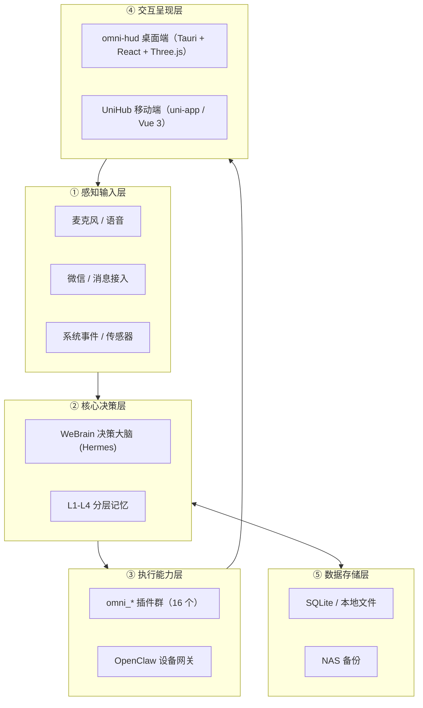

# AI-Omni

> 本地大脑 + 插件化能力的 AI 全能助手 —— 五层架构，隐私优先，核心数据全部本地运行。

**当前状态：M0–M46 全部完成** · 3080 项 pytest 自动化测试 · 桌面端 / 移动端 / 演示视频三线落地


> 文档时点：**2026-08-27**。集群设备 / GPU / 端口 / 挂载以 [`../ToIV/AGENTS.md`](../ToIV/AGENTS.md) 为准。本文不复制凭据或过时设备表。

**仓库**：origin = https://gitee.com/Winery_z/AI-Omni.git ；github 备份 = https://github.com/zhwangsir/AI-Omni.git 。当前分支 `main`（`e9f9186`）。2026-08-27 本机实测 origin/github 提交差 **0 / 0**。

登记册：M0–M46 完成，3080 pytest。`STATE.json`：`current_milestone=M46`，各 milestone status=completed（列表无 M37）；`phases[5]`「办公自动化增强」字段仍为 in_progress。TEST_LOG 记全量回归 **3080 passed**。

`STATE.json` 的 `model_backends` 为历史配置快照（含已退役端点），**现网以 ToIV/AGENTS.md + 真机为准**。

根目录文档五件套：README / AGENTS / DEVELOPMENT / STATE.json / TEST_LOG。`docs/`、CLAUDE.md、设备说明.md 已归档。

AI-Omni 是一个**完全运行在本地基础设施上**的个人 AI 全能助手：决策大脑复用 WeBrain (Hermes)，所有能力以 `omni_*` 插件形式按需接入。语音、音乐、家居、办公、微信、天气等能力已全部落地，用户数据不出内网。

- **隐私优先**：核心数据（记忆、对话、文件）全部本地运行与存储，无外发。
- **资产复用**：不重写已有本地资产（WeBrain / flipped / LUVU 等），只做编排与插件化封装；WeBrain 核心代码只读不改。
- **TDD 驱动**：测试先行，单元测试全部基于 fake 后端，无需音频硬件与 GPU；覆盖率门槛 ≥ 80%。

---

## 五层架构



---


## 里程碑（STATE.json，全部 completed）

Phase 1 语音交互 MVP · Phase 2 智能家居 · Phase 3 桌面 HUD + 数字人 · Phase 4 多模态感知 · Phase 5 办公自动化增强（phase 字段仍 in_progress，milestone M34–M46 已 completed）。

| 段 | 内容 |
|----|------|
| M0–M2 | 初始化 + omni_voice MVP + 真机语音链路 |
| M3–M11 | omni_home、omni-hud、粒子空间、数字人/显影场、维纳斯连续对话、工具调用、唤醒/TTS |
| M12–M16 | 灵动岛、Agent 可视化、omni_sdk 正式化、系统辅助 7 插件 |
| M17–M26 | 音乐/歌词/歌库、3D 歌单架、壁纸模式、天气电台、雪莉身份、统一 OpenClaw 网关 |
| M27–M33 | omni_openclaw 网关能力、nut-js 桌面自动化 |
| M34–M36 | 办公工作流、UniHub 办公模块、omni_office HTTP 桥 |
| M38 | omni_wechat（腾讯 iLink Bot API） |
| M39–M46 | demo-video Remotion 演示片至程序化 Canvas 粒子引擎 |

STATE 列表无 M37。约束：与 WeBrain 模块隔离（只新增 omni_* 插件、不改 WeBrain 核心）；Lucide React 唯一图标源；覆盖率门槛 0.8。

## 三大交付线

| 交付线 | 目录 | 技术栈 | 里程碑 | 说明 |
|--------|------|--------|--------|------|
| 桌面端 | `omni-hud/` | Tauri/Rust + React + Three.js | M0–M26 | 沉浸式粒子空间（WebGL 分档）、WellZone 交互井、实时字幕、音乐 Dock、Agent 面板、壁纸模式 |
| 移动端 | `UniHub/` | uni-app / Vue 3 | M1–M36 | Film Atelier 暗房风格：底部导航、语音交互、音乐播放、家居控制、天气、文档/邮件/日程 |
| 演示视频 | `demo-video/` | Remotion + Canvas 2D 粒子引擎 | M40–M46 | 59s 产品演示（程序化粒子引擎 + 雪莉旁白 + 暗房 BGM），产出 `out/ai-omni-demo-v7.mp4` |

---

## 插件矩阵（omni-brain/plugins/）

所有能力均为 `OmniPlugin` 插件（M15 起 `omni_sdk` 正式化，旧 `register(ctx)` 经 `compat.py` 适配），共 16 个：

| 插件 | 能力 |
|------|------|
| `omni_sdk` | 插件基座：生命周期、事件总线、权限、身份配置（雪莉 Sherry 单一数据源） |
| `omni_voice` | 语音管道：VAD 唤醒 → 网关 ASR → Agent → IndexTTS2 播报，全本地 |
| `omni_home` | 智能家居：Home Assistant WebSocket 同步、NLU、场景控制 |
| `omni_music` | 音乐：网易云/QQ/本地源、歌库、解密、看管扫描 |
| `omni_lyrics` | 歌词总线：LRC 解析、逐行同步（订阅 `music.started` 事件联动） |
| `omni_office` | 办公：文档 / 邮件 / 日程 + HTTP 服务 |
| `omni_wechat` | 微信：腾讯 iLink Bot API 收发全链路（唯一低风险方案） |
| `omni_weather` | 天气：Open-Meteo、情绪歌单联动 |
| `omni_openclaw` | 集群网关：设备状态、AICG、多模态（集群真相见 ToIV/AGENTS.md） |
| `omni_volume` / `omni_brightness` / `omni_power` / `omni_process` / `omni_performance` / `omni_screenshot` / `omni_fullscreen_detect` | macOS 系统辅助插件矩阵 |

---

## 目录结构

```
AI-Omni/
├── omni-brain/plugins/    # Python 后端：16 个 omni_* 插件（唯一新增代码形态）
├── omni-hud/              # 桌面端：Tauri/Rust 壳 + React 前端 + Three.js 粒子空间
├── UniHub/                # 移动端：uni-app / Vue 3（自有五件套，可有独立 git）
├── demo-video/            # Remotion 演示视频
├── tests/                 # pytest（全 fake 后端，无硬件依赖）
├── AGENTS.md / DEVELOPMENT.md / STATE.json / TEST_LOG.md
└── pyproject.toml         # pytest；coverage fail_under = 80
```


---

## 快速开始

### 环境要求

- Python ≥ 3.11（开发机 3.14）；Node ≥ 20；pnpm
- 单元测试**不需要**音频硬件 / GPU / 网络（全部 fake 后端）

### 运行测试

```bash
# 全量回归（3080+ 用例）
python3 -m pytest

# 桌面端 E2E（Playwright，fake Tauri IPC）
cd omni-hud/e2e && pnpm test
```

### 真机语音

```bash
pip install sounddevice   # 仅真机需要
PYTHONPATH=omni-brain/plugins python3 -m omni_voice run
```

> ASR / TTS / Embedding 经 Workstation 独立端点接入，本地不加载推理模型；VAD 为纯 Python 能量检测，零依赖。

---

## 基础设施与集群

ASR / TTS / Embedding 等算力后端在 Workstation，不在本机加载推理模型。现网服务、GPU、端口只认 [../ToIV/AGENTS.md](../ToIV/AGENTS.md) 与 SSH 真机，禁止沿用本 README 旧表（Studio EXO / Nemotron :8000 等记录已过时）。

## 文档导航

- [STATE.json](STATE.json) / [TEST_LOG.md](TEST_LOG.md) — 里程碑与测试日志（M0–M46）
- [AGENTS.md](AGENTS.md) — 本项目规则
- [DEVELOPMENT.md](DEVELOPMENT.md) — 归档文档索引
- [UniHub/README.md](UniHub/README.md) — 嵌套移动端
- [../ToIV/AGENTS.md](../ToIV/AGENTS.md) — 集群唯一真相源
- [../项目登记册.md](../项目登记册.md) — 项目组登记
