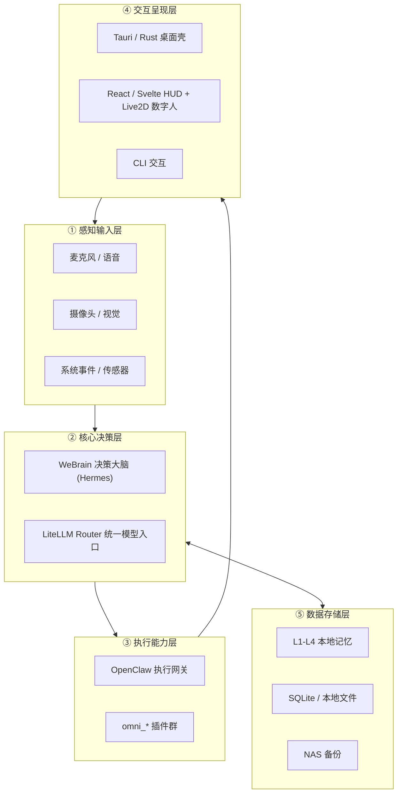

# AI-Omni

> 本地大脑 + 插件化能力的 AI 全能助手 —— 五层架构，隐私优先，核心数据全部本地运行。

AI-Omni 是一个**完全运行在本地基础设施上**的个人 AI 全能助手：决策大脑复用 WeBrain (Hermes)，执行网关复用 OpenClaw，所有能力以 `omni_*` 插件形式按需接入。语音、视觉、桌面自动化、智能家居、办公增强等能力分 Phase 逐层落地，用户数据不出内网。

- **隐私优先**：核心数据（记忆、对话、文件）全部本地运行与存储，无外发。
- **资产复用**：禁止重写已有本地资产（WeBrain / QieZiOS / flipped / LUVU / AIHub），只做编排与插件化封装。
- **TDD 驱动**：测试先行，单元测试全部基于 fake 后端，无需音频硬件与 GPU；覆盖率门槛 ≥ 80%。

---

## 五层架构



| 层 | 职责 | 主要载体 |
|----|------|----------|
| ① 感知输入层 | 语音、视觉、系统事件等原始输入采集与预处理 | `omni_voice` 等感知插件 |
| ② 核心决策层 | 推理、记忆、规划、模型路由 | WeBrain (Hermes) + LiteLLM Router |
| ③ 执行能力层 | 工具调用、桌面自动化、设备控制 | OpenClaw 网关 + `omni_*` 插件 |
| ④ 交互呈现层 | 桌面 HUD、数字人、CLI | Tauri 壳 + React/Svelte 前端 |
| ⑤ 数据存储层 | 记忆、配置、文件、备份 | L1-L4 记忆 / SQLite / NAS |

---

## 目录结构

```
AI-Omni/
├── omni-brain/               # Python 后端：决策大脑宿主与插件目录
│   └── plugins/
│       └── omni_voice/       # Phase 1 语音插件（M1）
├── omni-hud/                 # 交互呈现层前端（React/Svelte，Phase 3 启用）
├── omni-desktop/             # Tauri / Rust 桌面壳（Phase 3 启用）
├── omni-storage/             # 数据存储层服务（Phase 2+ 启用）
├── docs/
│   └── specs/                # 各 Phase 设计文档
│       └── phase1-voice-mvp.md
├── tests/                    # pytest 测试（全部 fake 后端，无硬件依赖）
├── scripts/                  # 开发 / 运维脚本
├── STATE.json                # 项目状态中枢（阶段 / 里程碑 / 约束 / 上游资产）
├── TEST_LOG.md               # 测试日志（按时间记录，含代码片段与结果）
├── pyproject.toml            # pytest 与覆盖率配置（fail_under = 80）
├── README.md                 # 本文件
├── PROJECT_INIT.md           # 项目初始化说明
├── AGENTS.md                 # Agent 协作规范
├── CLAUDE.md                 # 代码规范
└── UniHub/                   # 历史 uni-app 参考资产（只读，不参与构建）
```

---

## 快速开始

### 环境要求

- Python 3.11+（当前开发机：Python 3.14.6，pytest 9.1.1）
- 单元测试**不需要**任何音频硬件或重型依赖（全部使用 fake 后端）

### 运行测试

```bash
# 全量测试
python3 -m pytest

# 带覆盖率（门槛 80%，见 pyproject.toml）
python3 -m pytest --cov=omni-brain/plugins/omni_voice --cov-report=term-missing
```

### Phase 1 语音 MVP（真机运行）

真机运行仅需额外安装音频采集依赖（仅在真实设备上需要，单元测试不需要）：

```bash
pip install sounddevice

# CLI 语音交互（唤醒 → 录音 → 网关 ASR → Agent → 网关 TTS 播报）
python3 omni-brain/plugins/omni_voice/cli.py
```

> ASR / TTS / LLM 统一走 OpenClaw 网关（`:18789`）OpenAI 兼容端点，本地不加载模型；
> VAD 为纯 Python 能量检测，零依赖。

详细设计见 [docs/specs/phase1-voice-mvp.md](docs/specs/phase1-voice-mvp.md)，环境搭建与插件开发见 [PROJECT_INIT.md](PROJECT_INIT.md)。

---

## 路线图

| Phase | 名称 | 状态 | 说明 |
|-------|------|------|------|
| 1 | 语音交互 MVP | 🚧 进行中 | VAD 触发唤醒 + 网关 ASR（OpenClaw /audio/transcriptions）+ 网关 TTS（/audio/speech）+ WeBrain Agent 集成 + CLI |
| 2 | 智能家居控制 | ⏳ 待启动 | 设备发现与控制插件，本地家庭设备接入 |
| 3 | 桌面 HUD + 数字人 | ⏳ 待启动 | Tauri 桌面壳 + React/Svelte HUD + Live2D 数字人（复用 QieZiOS / flipped） |
| 4 | 多模态感知 | ⏳ 待启动 | 视觉感知、屏幕理解（K2.7 Code 多模态，EXO 集群） |
| 5 | 办公自动化增强 | ⏳ 待启动 | nut-js 桌面自动化、文档/邮件/日程工作流（复用 LUVU） |

当前状态以 [STATE.json](STATE.json) 为准。

---

## 资产复用清单（禁止重写）

| 资产 | 路径 | 复用内容 |
|------|------|----------|
| WeBrain webrain-core | `/Users/wangzhenyu/Desktop/ALLProject/WeBrain/webrain-core/` | 决策大脑 Hermes：S1 `evolution_viz`、S2 `prompt_engine`、S3 `context_engine`（L1-L4 记忆）、S4 `harness_engine`、S5 `loop_engine`（事件总线）、`webrain_privacy`、插件注册机制（`register_tool` / `register_hook`） |
| QieZiOS | `/Users/wangzhenyu/Desktop/ALLProject/QieZiOS/` | Svelte 5 前端基座：Live2D、eventBus、services、VFS |
| flipped | `/Users/wangzhenyu/Desktop/ALLProject/flipped/` | Tauri 桌面壳、MCP Server、多 Agent 编排、OpenHands 沙盒 |
| LUVU | `/Users/wangzhenyu/Desktop/ALLProject/LUVU/` | nut-js 桌面自动化、ComfyUI 接口 |
| AIHub | `/Users/wangzhenyu/Desktop/ALLProject/AIHub/` | EXO 集群代理、Docker Compose |

复用纪律见 [AGENTS.md](AGENTS.md)：WeBrain 核心代码不修改，AI-Omni 侧只新增 `omni_*` 插件，共用基础设施但不耦合。

---

## 硬件基础设施

| 节点 | 硬件 | 角色 | 服务 |
|------|------|------|------|
| openclaw01–04 | 4× Mac Mini（M2 Pro 24GB） | 主对话推理 | openclaw01 `:8000` SGLang **Qwen3.6**（OpenAI 兼容 API） |
| spark01–02 | 2× Spark（128GB HBM2e） | 复杂推理 + 统一路由 | spark01 `:8000` vLLM **Euryale 70B**；spark01 `:4000` **LiteLLM Router**（统一入口，OpenAI 兼容） |
| Mac Studio | EXO 集群 | 多模态 + 图像 | `:52415` **K2.7 Code** 多模态；**FLUX.1** 图像生成 |
| 2× PC | RTX 5090 | 图像生成 | ComfyUI |
| NAS | `\\192.168.71.7\dgmt-nas` | 存储 | 模型 / 数据备份 |

本地嵌入模型：**bge-small-zh-v1.5**。所有模型调用统一走 LiteLLM Router（`http://spark01:4000/v1`），插件不直连具体推理节点。

---

## 文档导航

- [PROJECT_INIT.md](PROJECT_INIT.md) — 开发环境搭建、测试运行、新增 `omni_*` 插件指南
- [AGENTS.md](AGENTS.md) — 子 Agent 团队协作规范、里程碑工作流、TDD 与隔离纪律
- [CLAUDE.md](CLAUDE.md) — Python / 插件 / UI 代码规范
- [docs/specs/phase1-voice-mvp.md](docs/specs/phase1-voice-mvp.md) — Phase 1 语音交互 MVP 设计文档
- [STATE.json](STATE.json) / [TEST_LOG.md](TEST_LOG.md) — 项目状态中枢与测试日志
