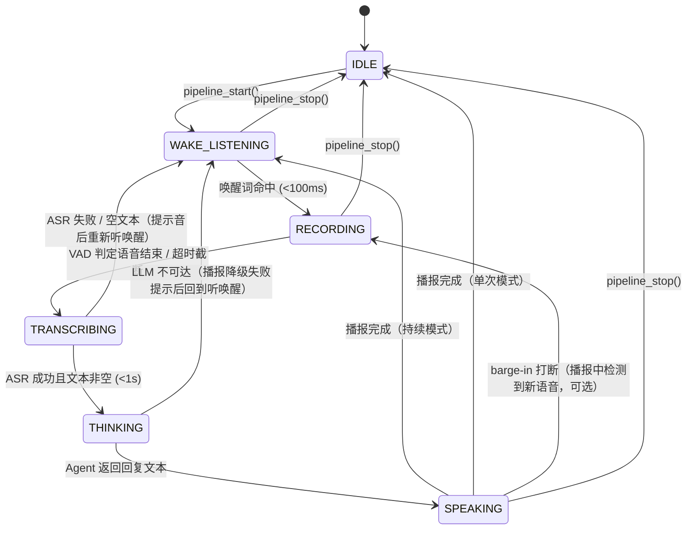
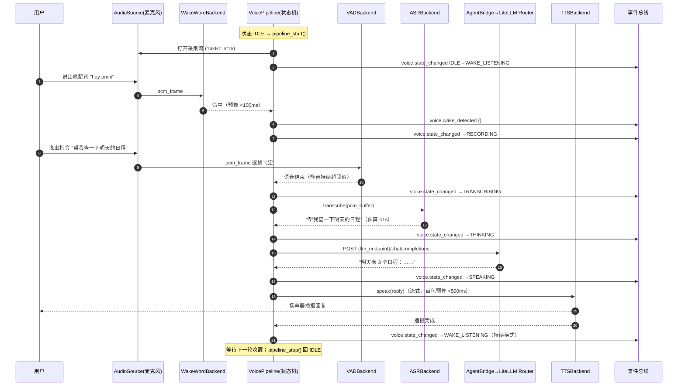

# Phase 1 · 语音交互 MVP 设计文档

> 版本: v1.0 | 日期: 2026-07-20 | 里程碑: M1（子任务 M1.1–M1.6） | 状态: 进行中
> 关联: [STATE.json](../../STATE.json) `M1` | 规范: [CLAUDE.md](../../CLAUDE.md) / [AGENTS.md](../../AGENTS.md)

## 目录

1. [目标与范围](#一目标与范围)
2. [架构设计](#二架构设计)
3. [关键设计决策](#三关键设计决策)
4. [接口契约（Hermes Tools）](#四接口契约hermes-tools)
5. [配置项](#五配置项)
6. [数据流：一次完整语音交互](#六数据流一次完整语音交互)
7. [测试计划](#七测试计划)
8. [验收标准](#八验收标准)
9. [风险与缓解](#九风险与缓解)
10. [里程碑拆分 M1.1–M1.6](#十里程碑拆分-m11m16)

---

## 一、目标与范围

### 1.1 目标

为 AI-Omni 打通**全链路本地语音交互**：用户说话 → 本地识别 → WeBrain 大脑思考 → 本地合成播报。全程核心数据不出本机 / 内网，契合"隐私优先"总纲。

### 1.2 范围内（MVP 必须交付）

| # | 能力 | 技术选型 |
|---|------|----------|
| 1 | VAD 语音活动检测 | `silero-vad`（本地） |
| 2 | 本地 ASR 语音识别 | `faster-whisper`（首选）/ whisper.cpp（备选后端） |
| 3 | 本地 TTS 语音合成 | `kokoro`（首选）/ MeloTTS（备选后端） |
| 4 | 语音唤醒 | `openWakeWord`（本地唤醒词检测） |
| 5 | 与 WeBrain gateway 集成 | 语音 → Agent（LiteLLM Router，OpenAI 兼容 API）→ 语音 |
| 6 | 基础 CLI 交互界面 | `omni_voice/cli.py`，支持启动 / 停止管道、单次对话、状态查看 |
| 7 | Hermes tools 注册 | 6 个 `voice_*` 工具挂到 WeBrain 插件机制（见第四章） |

### 1.3 范围外（本 Phase 明确不做）

- 桌面 HUD / Live2D 数字人口型同步（Phase 3）
- 声纹识别、多说话人分离
- 多轮对话的跨会话记忆晋级策略（沿用大脑默认 L1 行为即可）
- 移动端 / Web 端语音采集
- 唤醒词自定义训练（使用 openWakeWord 预训练模型）

### 1.4 成功标准（一句话）

在真机上对设备说唤醒词并下达指令，**唤醒 <100ms、ASR <1s、TTS 首包 <500ms** 地完成一轮"语音进、语音出"交互；在无任何音频硬件的开发机上 `python3 -m pytest` 全绿且覆盖率 ≥ 80%。

---

## 二、架构设计

### 2.1 语音管道状态机

管道核心是一个显式状态机，任意时刻处于且仅处于一个状态：



状态说明：

| 状态 | 含义 | 进入动作 | 退出条件 |
|------|------|----------|----------|
| `IDLE` | 管道未运行，不占音频设备 | 释放采集流 | `pipeline_start()` |
| `WAKE_LISTENING` | 低功耗监听唤醒词 | 打开采集流，帧送 WakeWordBackend | 唤醒命中 / stop |
| `RECORDING` | 录制用户指令 | 开始缓冲 PCM，帧送 VADBackend | VAD 判停 / 超时 / stop |
| `TRANSCRIBING` | ASR 识别中 | 将缓冲送 ASRBackend | 得文本（空/失败回听唤醒） |
| `THINKING` | 等待 Agent 回复 | 文本送 AgentBridge | 得回复 / 异常降级 |
| `SPEAKING` | TTS 合成并播报 | 回复文本送 TTSBackend | 播报完 / 打断 / stop |

每次状态迁移通过事件总线发布：`event_publish("voice.state_changed", {"from": ..., "to": ..., "ts": ...})`，供 CLI / 未来 HUD 订阅。

### 2.2 模块划分

```
omni-brain/plugins/omni_voice/
├── plugin.yaml                 # 插件元数据（name: omni_voice, provides_tools: voice_*）
├── __init__.py                 # register(ctx)：注册 6 个 voice_* tools
├── config.py                   # VoiceConfig dataclass：默认值 + 环境变量覆盖 + 校验
├── backends/
│   ├── __init__.py
│   ├── base.py                 # 抽象层：VADBackend / ASRBackend / TTSBackend / WakeWordBackend（Protocol）
│   ├── vad_silero.py           # SileroVADBackend（惰性导入 silero-vad）
│   ├── asr_faster_whisper.py   # FasterWhisperASRBackend（惰性导入 faster-whisper）
│   ├── tts_kokoro.py           # KokoroTTSBackend（惰性导入 kokoro）
│   └── wake_openwakeword.py    # OpenWakeWordBackend（惰性导入 openwakeword）
├── audio.py                    # 音频采集 / 播放抽象 AudioSource / AudioSink（sounddevice 惰性导入）
├── pipeline.py                 # VoicePipeline：状态机编排，后台线程 + stop_event
├── agent_bridge.py             # AgentBridge：LiteLLM Router OpenAI 兼容客户端（/v1/chat/completions）
├── tools.py                    # 6 个 voice_* tool 的 schema 与 handler（handler 返回 JSON 字符串）
└── cli.py                      # CLI 交互界面：start / stop / once / say / status / config
```

各模块职责：

| 模块 | 职责 | 关键约束 |
|------|------|----------|
| `backends/base.py` | 定义 4 个后端 Protocol（结构化类型），真实后端与 fake 后端共同实现 | 只定义接口，不 import 任何重型依赖 |
| `backends/vad_silero.py` 等 | 真实后端实现；构造时惰性导入依赖，缺失即抛 `BackendUnavailableError` | 顶层零重型 import |
| `audio.py` | 麦克风帧采集与扬声器播放的抽象；真实实现基于 sounddevice | 同样惰性导入；提供 `FakeAudioSource`（帧队列注入） |
| `pipeline.py` | 状态机 + 编排：唤醒→录音→识别→思考→播报 | 跑在后台 `threading.Thread`，`stop_event` 协作式停止 |
| `agent_bridge.py` | 把识别文本发给 LiteLLM Router（默认 `http://spark01:4000/v1`），取回回复文本 | 标准 `openai` SDK 或 `urllib`，可注入 fake |
| `config.py` | 配置加载：默认值 → 环境变量覆盖 → 运行时 patch | dataclass + `from_env()` |
| `tools.py` | Hermes tool 契约层：schema + handler，handler 返回 JSON 字符串 | 错误统一 `{"ok": false, "error": {...}}` |
| `cli.py` | 人用的命令行入口，内部复用 pipeline / tools | 不作为 tool 契约的一部分 |

### 2.3 后端抽象接口（Protocol）

```python
class WakeWordBackend(Protocol):
    def detect(self, pcm_frame: bytes) -> bool: ...
        # 输入一帧 16kHz int16 PCM，命中唤醒词返回 True

class VADBackend(Protocol):
    def is_speech(self, pcm_frame: bytes) -> bool: ...
        # 输入一帧 PCM，返回当前帧是否语音

class ASRBackend(Protocol):
    def transcribe(self, pcm: bytes, sample_rate: int) -> str: ...
        # 输入整段 PCM，返回识别文本（空串表示未识别）

class TTSBackend(Protocol):
    def speak(self, text: str, voice: str | None = None) -> None: ...
        # 合成并播报文本；首包延迟预算 <500ms
```

真实后端（Silero / faster-whisper / Kokoro / openWakeWord）与测试 fake 后端实现同一组 Protocol，`VoicePipeline` 只依赖 Protocol，不感知具体实现。

---

## 三、关键设计决策

| # | 决策 | 理由与代价 |
|---|------|-----------|
| D1 | **重型依赖惰性导入且可缺省** | `torch / sounddevice / faster-whisper / silero-vad / kokoro / openwakeword` 只在后端工厂函数内 import；`ImportError` → `BackendUnavailableError` → tool 返回 `E_BACKEND_UNAVAILABLE`。保证：未装音频依赖的开发机 / CI 也能 import 插件并全量跑测试。代价：错误暴露推迟到运行时首次使用，用清晰错误码弥补。 |
| D2 | **依赖注入，测试全部用 fake 后端** | `VoicePipeline(vad=..., asr=..., tts=..., wake=..., audio=..., bridge=...)` 构造时注入；测试注入 fake，无需音频硬件 / 模型文件 / 内网 LLM。pipeline 逻辑（状态机、超时、降级）因此可 100% 离线与确定性测试。 |
| D3 | **管道跑在后台线程，stop_event 控制** | `pipeline.start()` 创建 daemon 线程跑状态机循环；`pipeline.stop()` 置 `threading.Event`，循环每轮检查、协作式退出（join 带超时）。避免占住调用方（Hermes 主循环 / CLI 主线程）；不用信号、不用强杀。 |
| D4 | **单例双重检查锁** | 管道与后端的全局访问器使用 WeBrain `plugins/plugin_utils.py` 的 `lazy_singleton` / `SingletonSlot`（双重检查锁），保证多线程（tool 调用 + CLI）下只存在一个管道实例，且不手搓锁。 |
| D5 | **Agent 走 LiteLLM Router 而非直连** | `agent_bridge` 只连 `llm_endpoint`（默认 `http://spark01:4000/v1`，OpenAI 兼容），模型选择 / 故障转移由 Router 负责，插件不感知 openclaw01 / spark01 等具体节点。 |
| D6 | **状态迁移全部发事件** | 每次迁移 `event_publish("voice.state_changed", ...)`，CLI 据此渲染，Phase 3 HUD 零改动接入。 |

---

## 四、接口契约（Hermes Tools）

注册方式：`register(ctx)` 中对每个 tool 调 `ctx.register_tool(name, description, emoji, schema, handler_func)`；**handler 返回 JSON 字符串**（`json.dumps(..., ensure_ascii=False)`）。

通用约定：

- 成功：`{"ok": true, ...}`
- 失败：`{"ok": false, "error": {"code": "<错误码>", "message": "<中文可读描述>"}}`
- 错误码总表见 4.8。

### 4.1 `voice_status` — 查询管道状态

**参数**：无。

**schema**：
```json
{"type": "object", "properties": {}, "additionalProperties": false}
```

**返回**：
```json
{
  "ok": true,
  "running": true,
  "state": "WAKE_LISTENING",
  "uptime_s": 123.4,
  "backends": {"wake_word": "openwakeword", "vad": "silero", "asr": "faster-whisper", "tts": "kokoro"},
  "config": {"sample_rate": 16000, "wake_word": "hey_omni", "llm_endpoint": "http://spark01:4000/v1"}
}
```

### 4.2 `voice_speak` — 播报一段文本

**schema**：
```json
{
  "type": "object",
  "properties": {
    "text":  {"type": "string", "minLength": 1, "description": "要播报的文本"},
    "voice": {"type": "string", "description": "可选，覆盖默认 TTS 音色"},
    "wait":  {"type": "boolean", "default": true, "description": "是否阻塞到播报完成"}
  },
  "required": ["text"],
  "additionalProperties": false
}
```

**返回**：
```json
{"ok": true, "spoken_chars": 42, "voice": "zf_xiaoxiao", "duration_ms": 3100}
```

`wait=false` 时 `duration_ms` 为 `null`，文本进入播报队列立即返回。

### 4.3 `voice_listen_once` — 单次聆听（不走唤醒词）

**schema**：
```json
{
  "type": "object",
  "properties": {
    "timeout_s":      {"type": "number", "default": 10, "minimum": 1, "maximum": 60, "description": "等待语音开始的超时（秒）"},
    "max_record_s":   {"type": "number", "default": 30, "minimum": 1, "maximum": 120, "description": "最长录音（秒）"},
    "send_to_agent":  {"type": "boolean", "default": false, "description": "识别后是否送 Agent 并播报回复"}
  },
  "additionalProperties": false
}
```

**返回**（`send_to_agent=false`）：
```json
{"ok": true, "transcript": "今天天气怎么样", "record_ms": 2350, "asr_ms": 420}
```

**返回**（`send_to_agent=true`）：
```json
{"ok": true, "transcript": "今天天气怎么样", "agent_reply": "今天晴，26℃。", "record_ms": 2350, "asr_ms": 420, "llm_ms": 890, "tts_first_byte_ms": 310}
```

超时无语音：`{"ok": false, "error": {"code": "E_TIMEOUT", "message": "10 秒内未检测到语音"}}`。

### 4.4 `voice_pipeline_start` — 启动持续语音管道

**schema**：
```json
{
  "type": "object",
  "properties": {
    "mode": {"type": "string", "enum": ["wake_word", "push_to_talk"], "default": "wake_word", "description": "wake_word=唤醒词触发；push_to_talk=每次交互需显式触发（预留）"}
  },
  "additionalProperties": false
}
```

**返回**：
```json
{"ok": true, "running": true, "state": "WAKE_LISTENING", "mode": "wake_word"}
```

已在运行：`{"ok": false, "error": {"code": "E_ALREADY_RUNNING", "message": "语音管道已在运行"}}`。

### 4.5 `voice_pipeline_stop` — 停止语音管道

**参数**：无。

**返回**：
```json
{"ok": true, "running": false, "stopped": true, "last_state": "WAKE_LISTENING"}
```

未在运行：`{"ok": false, "error": {"code": "E_NOT_RUNNING", "message": "语音管道未在运行"}}`。

### 4.6 `voice_config` — 读取 / 修改运行时配置

**schema**：
```json
{
  "type": "object",
  "properties": {
    "action": {"type": "string", "enum": ["get", "set", "reload"], "default": "get"},
    "patch":  {"type": "object", "description": "action=set 时要合并的配置键值（仅允许第五章列出的键）"}
  },
  "additionalProperties": false
}
```

**返回**（get / set / reload 均回显生效配置）：
```json
{
  "ok": true,
  "action": "set",
  "applied": {"vad_threshold": 0.6},
  "config": {"sample_rate": 16000, "wake_word": "hey_omni", "vad_threshold": 0.6, "whisper_model": "small", "tts_voice": "zf_xiaoxiao", "llm_endpoint": "http://spark01:4000/v1", "llm_model": "qwen3.6"}
}
```

非法键 / 非法值：`{"ok": false, "error": {"code": "E_INVALID_CONFIG", "message": "不支持的配置键: foo"}}`。

### 4.7 注册总表

```python
_TOOLS = (
    ("voice_status",         "查询语音管道运行状态与后端信息",   "🎙️"),
    ("voice_speak",          "用本地 TTS 播报一段文本",           "🔊"),
    ("voice_listen_once",    "单次聆听：录音→识别（可选送 Agent）", "👂"),
    ("voice_pipeline_start", "启动持续语音交互管道（唤醒词模式）",  "▶️"),
    ("voice_pipeline_stop",  "停止语音交互管道",                  "⏹️"),
    ("voice_config",         "读取 / 修改语音插件运行时配置",      "⚙️"),
)
```

### 4.8 错误码总表

| 错误码 | 含义 | 典型触发 |
|--------|------|----------|
| `E_BACKEND_UNAVAILABLE` | 后端依赖缺失或模型不可用 | 未安装 faster-whisper / kokoro；模型文件缺失 |
| `E_AUDIO_DEVICE` | 音频设备打开失败 | 无麦克风 / 设备被占用 |
| `E_TIMEOUT` | 操作超时 | `voice_listen_once` 超时无语音 |
| `E_ALREADY_RUNNING` | 管道已在运行 | 重复 `voice_pipeline_start` |
| `E_NOT_RUNNING` | 管道未在运行 | 未启动就 `voice_pipeline_stop` |
| `E_INVALID_STATE` | 当前状态不允许该操作 | TRANSCRIBING 中调用 listen_once |
| `E_LLM_UNREACHABLE` | LLM 端点不可达 | LiteLLM Router 连接失败 / 超时 |
| `E_ASR_FAILED` | 识别失败 | ASR 后端内部异常 |
| `E_TTS_FAILED` | 合成 / 播报失败 | TTS 后端内部异常 |
| `E_INVALID_CONFIG` | 配置非法 | 未知配置键 / 阈值越界 |

---

## 五、配置项

`config.py` 的 `VoiceConfig` dataclass；默认值 → 环境变量覆盖（`from_env()`）→ `voice_config set` 运行时 patch。

| 配置键 | 默认值 | 环境变量 | 说明 |
|--------|--------|----------|------|
| `sample_rate` | `16000` | `OMNI_VOICE_SAMPLE_RATE` | 全链路采样率（Hz），唤醒 / VAD / ASR 统一 16k |
| `wake_word` | `hey_omni` | `OMNI_WAKE_WORD` | openWakeWord 预训练模型名 |
| `vad_threshold` | `0.5` | `OMNI_VAD_THRESHOLD` | VAD 语音判定阈值 ∈ [0, 1] |
| `whisper_model` | `small` | `OMNI_WHISPER_MODEL` | faster-whisper 模型规格（tiny/base/small/medium） |
| `tts_voice` | `zf_xiaoxiao` | `OMNI_TTS_VOICE` | Kokoro 音色 |
| `llm_endpoint` | `http://spark01:4000/v1` | `OMNI_LLM_ENDPOINT` | LiteLLM Router OpenAI 兼容端点 |
| `llm_model` | `qwen3.6` | `OMNI_LLM_MODEL` | 经 Router 路由的模型名 |
| `llm_timeout_s` | `30` | `OMNI_LLM_TIMEOUT_S` | Agent 请求超时（秒） |
| `max_record_s` | `30` | `OMNI_MAX_RECORD_S` | 单次录音上限（秒） |

环境变量校验失败（非数字 / 越界）时忽略该变量并记录 warning，不阻断启动；`voice_config set` 的非法输入则返回 `E_INVALID_CONFIG`。

---

## 六、数据流：一次完整语音交互



要点：

- 全程只在本机处理音频；唯一出机请求是发往**内网** LiteLLM Router 的文本。
- 每步耗时打点（`wake_ms / asr_ms / llm_ms / tts_first_byte_ms`），随 `voice.state_changed` payload 与 `voice_listen_once` 返回暴露，用于延迟预算回归。
- ASR 结果经 `memory_store(content, layer="L1", importance=0.5)` 写入会话级记忆（由大脑侧默认行为接管晋级）。

---

## 七、测试计划

测试目录 `tests/omni_voice/`，全部 fake 后端 + 依赖注入；**不需要音频硬件、模型文件、内网 LLM**。

### 7.1 单元测试

| 测试文件 | 覆盖目标 | 关键用例 |
|----------|----------|----------|
| `test_config.py` | 配置加载 | 默认值正确；`OMNI_VOICE_*` 环境变量覆盖生效；非法环境变量被忽略并告警；`voice_config set` 非法键返回 `E_INVALID_CONFIG` |
| `test_backends_fake.py` | 后端抽象与 fake | fake VAD/ASR/TTS/WakeWord 实现 Protocol；真实后端模块在依赖缺失时 import 不炸、构建抛 `BackendUnavailableError`（monkeypatch `__import__` 模拟缺失） |
| `test_state_machine.py` | 状态机迁移 | 覆盖 2.1 全部合法迁移（含 ASR 空文本回 WAKE_LISTENING、LLM 失败降级、stop 任意状态回 IDLE）；非法迁移被拒绝且状态不变；每次迁移发出 `voice.state_changed` 事件 |
| `test_tools.py` | tool handler JSON 契约 | 6 个 handler 均返回合法 JSON 字符串；成功结构 `ok:true`；错误结构含 `code/message`；schema 校验（必填缺失、越界参数）触发对应错误码；`voice_pipeline_start` 幂等性（重复调用 `E_ALREADY_RUNNING`） |
| `test_pipeline_threading.py` | 线程生命周期 | start 后线程存活、stop 后协作退出（join 超时内结束）；重复 start/stop 安全；`lazy_singleton` 访问器多线程并发取得同一实例 |
| `test_agent_bridge.py` | LLM 客户端 | 注入 fake transport：请求体符合 OpenAI chat.completions 格式；超时映射 `E_LLM_UNREACHABLE`；非 200 响应映射错误 |

### 7.2 集成测试：端到端 fake 管道

`test_pipeline_e2e.py`——全链路组装 fake 后端，验证编排正确性：

1. 组装：`VoicePipeline(wake=FakeWake, vad=FakeVAD, asr=FakeASR, tts=FakeTTS, audio=FakeAudioSource, bridge=FakeBridge)`。
2. `FakeAudioSource` 注入帧序列：[`唤醒帧`, `语音帧×N`, `静音帧×M`]。
3. 启动管道，驱动状态机走完 WAKE_LISTENING → RECORDING → TRANSCRIBING → THINKING → SPEAKING。
4. **核心断言：`FakeTTS.spoken_texts == ["明天有 3 个日程：……"]`**（即 TTS 收到的文本 == FakeBridge 对 FakeASR 识别文本的回复），且事件序列与预期迁移序列完全一致。
5. 变体：ASR 返回空 → 不调用 bridge / TTS，直接回 WAKE_LISTENING；bridge 抛超时 → 走降级分支并发布错误事件。

### 7.3 覆盖率

- 命令：`python3 -m pytest --cov=omni-brain/plugins/omni_voice --cov-report=term-missing`
- 门槛：**≥ 80%**（`pyproject.toml` `fail_under = 80`），状态机迁移与 6 个 handler 的 happy path + 错误路径必须全覆盖。

---

## 八、验收标准

| # | 验收项 | 判定方式 |
|---|--------|----------|
| A1 | `python3 -m pytest` 全绿（无音频依赖环境） | CI / 开发机直接运行 |
| A2 | omni_voice 覆盖率 ≥ 80% | `--cov` 报告 |
| A3 | 6 个 `voice_*` tools 注册成功、契约符合第四章 | `test_tools.py` + 真机 `hermes tools` 列表核对 |
| A4 | 真机一轮唤醒→对话→播报跑通 | 人工演示 + TEST_LOG.md 记录 |
| A5 | 延迟预算达标：唤醒 <100ms / ASR <1s / TTS 首包 <500ms | 真机打点日志 |
| A6 | STATE.json M1 子任务全部 completed；TEST_LOG.md 按时间记录含代码片段与测试结果 | reviewer 审计 |

---

## 九、风险与缓解

| # | 风险 | 影响 | 缓解 |
|---|------|------|------|
| R1 | **模型下载**：faster-whisper / Kokoro / openWakeWord 首次运行需下载模型（数百 MB），内网 / 离线环境可能失败 | 真机首跑阻塞 | 提供 `scripts/download_voice_models.py` 预下载脚本；模型缓存目录指向 NAS（`\\192.168.71.7\dgmt-nas`）做内网镜像；文档注明缓存路径环境变量；缺失时 `E_BACKEND_UNAVAILABLE` 明确提示 |
| R2 | **延迟预算不达标**（Mac Mini M2 Pro 上 whisper small / Kokoro 实时性） | 交互迟滞 | 预算硬指标写进 A5；打点先行（第六章节拍），不达标时降级路径：`whisper_model` 降 tiny/base、TTS 切 MeloTTS、ASR 换 whisper.cpp；逐预算项单独优化 |
| R3 | 音频设备差异（macOS 麦克风权限 / 占用） | 真机运行失败 | `E_AUDIO_DEVICE` 清晰报错 + CLI `doctor` 式自检命令；采集失败自动重开流一次 |
| R4 | 唤醒误触发 / 漏触发 | 体验差 | `vad_threshold` 与唤醒灵敏度做成可配置（第五章）；TEST_LOG 记录真机误触率，必要时更换唤醒词模型 |
| R5 | LiteLLM Router 不可达 | 语音交互中断 | `E_LLM_UNREACHABLE` + 本地降级话术播报；bridge 超时可配置；Router 侧故障转移由基础设施负责（不在本插件耦合） |
| R6 | 后台线程泄漏（stop 后线程未退出 / 音频流未释放） | 资源占用、二次启动失败 | `stop_event` 协作退出 + join 超时 + `test_pipeline_threading.py` 生命周期测试兜底 |

### 延迟预算汇总（硬指标）

| 环节 | 预算 | 打点字段 |
|------|------|----------|
| 唤醒词检测 | **< 100ms**（从帧进入到状态迁移） | `wake_ms` |
| ASR 识别 | **< 1s**（录音结束到文本返回） | `asr_ms` |
| TTS 首包 | **< 500ms**（speak 调用到首个音频块播出） | `tts_first_byte_ms` |
| LLM 回复 | 软目标 < 3s（内网 Qwen3.6，超时时长 `llm_timeout_s` 兜底） | `llm_ms` |

---

## 十、里程碑拆分 M1.1–M1.6

| 子任务 | 名称 | 产出物 | 验收 |
|--------|------|--------|------|
| M1.1 | omni_voice 插件骨架 | `plugin.yaml`、`__init__.py`（`register(ctx)` 注册 6 个 tools 的 stub）、`config.py` | 插件可被加载器发现；`voice_status` 返回静态 JSON；stub 测试先行通过 |
| M1.2 | 抽象后端 + 依赖注入 | `backends/base.py` 4 个 Protocol、4 个真实后端（惰性导入）、`audio.py` 抽象 + `FakeAudioSource` | 依赖缺失时 import 安全、构建抛 `BackendUnavailableError`；fake 后端通过 Protocol 检查 |
| M1.3 | 语音管道编排 | `pipeline.py` 状态机 + 后台线程 + `stop_event`；`agent_bridge.py` | 状态机迁移测试全绿；端到端 fake 管道集成测试通过（TTS 收到正确文本） |
| M1.4 | CLI 交互界面 | `cli.py`：`start / stop / once / say / status / config` 子命令 | CLI 在 fake 后端下可演示全流程；帮助文本完整 |
| M1.5 | TDD 单元测试 + 集成测试 | `tests/omni_voice/` 全套（7.1–7.3） | `python3 -m pytest` 全绿，覆盖率 ≥ 80% |
| M1.6 | 全量回归 + 文档归档 | 全量 `pytest` 回归记录、真机验收记录、本设计文档与实际实现对齐修订 | A1–A6 全部满足；STATE.json / TEST_LOG.md 更新完毕，reviewer 审计通过 |

> 执行纪律：每个子任务走 [AGENTS.md](../../AGENTS.md) 里程碑工作流——独立 subagent 实现、TDD 先行、两阶段 review、STATE.json / TEST_LOG.md 同步更新。
